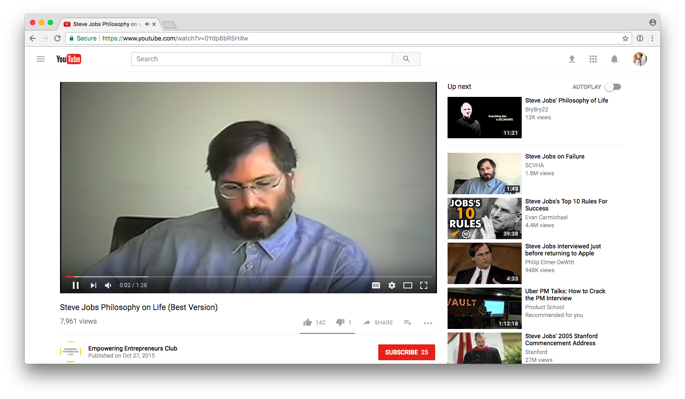
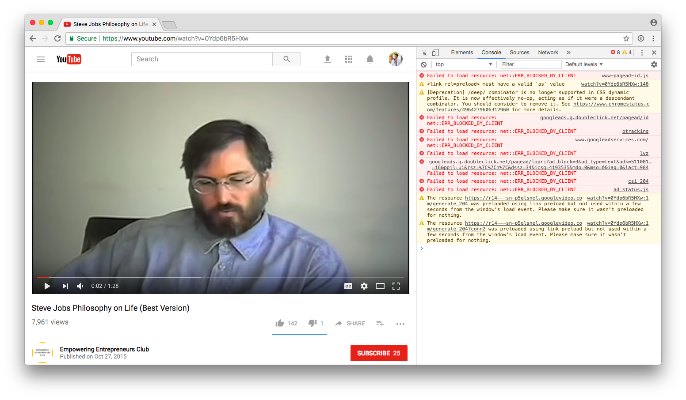
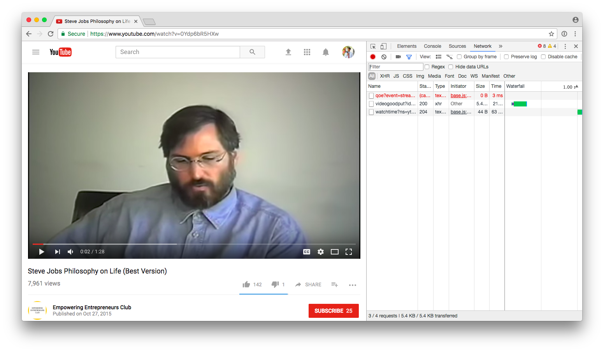
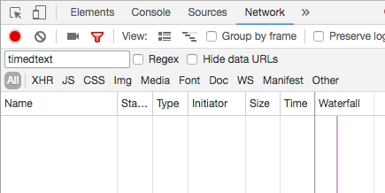
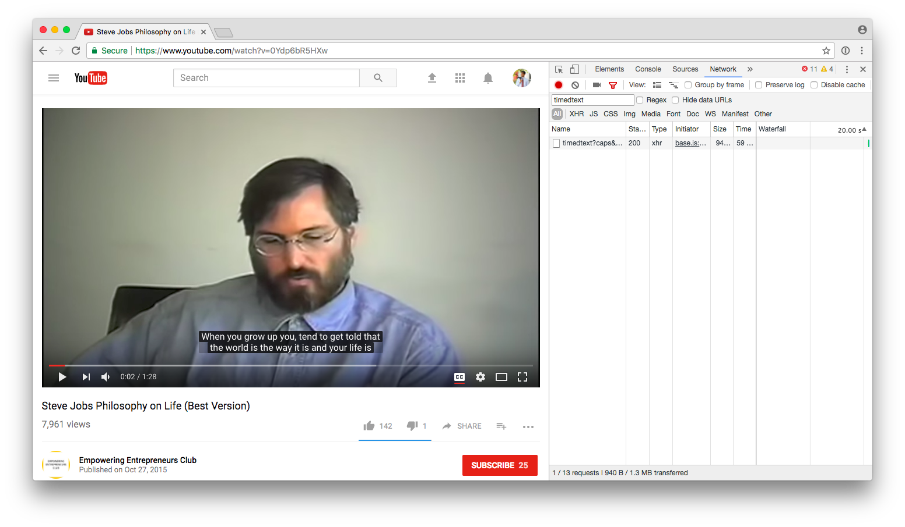
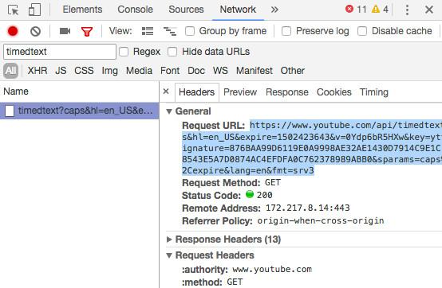
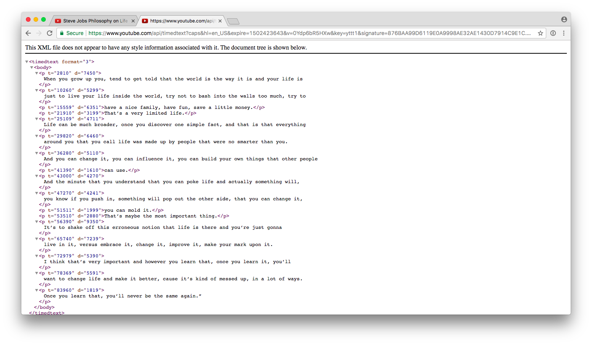

# YouTube Transcriber

Need to transcribe a YouTube video? Turns out that YouTube already makes pretty good automated captions. With this script, you can grab those captions in seconds - so you can, effectively, automatically transcribe your YouTube video!

This script has been tested on several videos and should work with no setup besides having Python and Jupyter installed. Here's how you can do it!

## Example

Consider [this example video](https://www.youtube.com/watch?v=0Ydp6bR5HXw). YouTube provides a `timedtext` file for it (we'll show you how to get it in a bit) that contains the auto-generated captions. The `timedtext` looks a bit like this:

```xml
<timedtext format="3">
    <body>
    <p t="2810" d="7450">
When you grow up you, tend to get told that the world is the way it is and your life is
</p>
    <p t="10260" d="5299">
just to live your life inside the world, try not to bash into the walls too much, try to
</p>
    <p t="15559" d="6351">have a nice family, have fun, save a little money.</p>

    ...

    <p t="83960" d="1819">
Once you learn that, you’ll never be the same again.”
</p>
    </body>
</timedtext>
```

This script formats it as such:


> When you grow up you, tend to get told that the world is the way it is and your life is just to live your life inside the world, try not to bash into the walls too much, try to have a nice family, have fun, save a little money. That’s a very limited life. Life can be much broader, once you discover one simple fact, and that is that everything around you that you call life was made up by people that were no smarter than you. And you can change it, you can influence it, you can build your own things that other people can use. And the minute that you understand that you can poke life and actually something will, you know if you push in, something will pop out the other side, that you can change it, you can mold it. That’s maybe the most important thing. It’s to shake off this erroneous notion that life is there and you’re just gonna live in it, versus embrace it, change it, improve it, make your mark upon it. I think that’s very important and however you learn that, once you learn it, you’ll want to change life and make it better, cause it’s kind of messed up, in a lot of ways. Once you learn that, you’ll never be the same again.”


## Getting started

First, fire up the Jupyter notebook. [Here's how to install Jupyter, if you don't already have it](https://jupyter.org/install.html).

Next you need to get the URL of a `timedtext` file from your YouTube video. This file basically contains YouTube's formatted, auto-generated transcription. This is a bit tricky to get, though. Here's how.

First, open up the YouTube video you want to automatically transcribe. [Here's an example](https://www.youtube.com/watch?v=0Ydp6bR5HXw).



Immediately pause the video. Now open the developer console (Cmd+Opt+K on Macs):



Then go to the "Network" tab:



Now enter `timedtext` in the filter bar:



You should see nothing. Now turn on closed captions on the video (as by hitting the "CC" button):



Then you'll see something appear in the console! Click on the "name" text and you'll see a URL appear:



Copy that Request URL and open it in a new tab. You should see something like this:



That's the URL you want! It'll be something like `https://www.youtube.com/api/timedtext?caps&hl=en_US&expire=1502423643&v=0Ydp6bR5HXw...`.

Finally, open up the iPython notebook and paste that URL in the parameters field, then run the script. The text will be outputted and also put into the `tmp/out.txt` files!


## Pitfalls

This script may not capture all the punctuation and  capitalization that you need, and it might not transcribe some words properly. (YouTube's transcription is good, but not perfect!)

As such, I recommend going through the output manually to make sure you catch anything YouTube missed.

## Results

I used this script for a project where we had to transcribe several YouTube videos with just hours to spare before the deadline.

This project let us transcribe a 10-minute video in about 15 minutes (mostly because we had to add extensive hand-edits), whereas transcribing manually would have taken about an hour.
